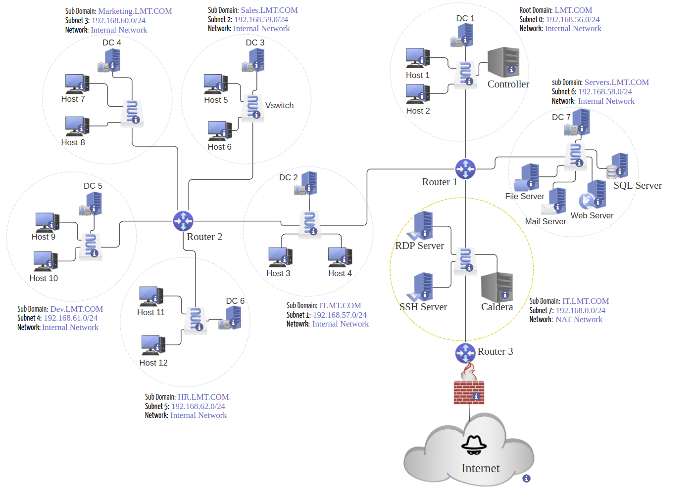

# LMDG: A Framework for Lateral Movement Datasets Generation

## Overview

This repository contains the documentation, code and dataset description for the paper titled *"[LMDG: A Framework for Lateral Movement Datasets Generation]"*. The **LMDG framework** is a cybersecurity research framework designed to simulate realistic organizational networks and generate high-fidelity datasets for studying advanced cyberattacks like lateral movement and advanced persistent threats (APTs). Built on **Virtualization** and **Active Directory (AD)**, it emulates diverse network topologies and realistic enterprise environments, integrating tools like **Wireshark** and **Windows Event Logs** for robust data collection. Key components include a flexible **Testbed creation process**, a **Benign Data Engine** for simulating realistic user behavior, an **Attack Engine (Caldera)** for automating adversary emulation, and an innovative **Labelling Engine** for accurately extracting attack records with minimal noise. This comprehensive framework enables the development and evaluation of advanced detection models in highly realistic settings. 

---

## Table of Contents
- [Project Overview](#overview)
- [Testbed Architecture](#testbed-architecture)
- [Dataset](#dataset)

---

## Testbed Architecture

This network, showed in figure 1, simulates a small-sized company with five departments, each residing in a distinct network segment with its dedicated Windows domain. For instance, the Sales department operates within the domain of sales.lmt.com and is situated in the subnet 192.168.59.0/24 with its dedicated domain controller DC 3. Three additional subnets are present in the network configuration: one signifies the root Windows domain lmt.com, another accommodates the company’s servers, and a third denotes a DMZ, i.e., 192.168.0.0/24 which is part of the IT Windows domain. Routers facilitate connections between these diverse subnets. Naturally, the structure of this network can be adjusted and expanded as needed.

In our experimental setup, VirtualBox networking was utilized to configure network segmentation. All subnets were established as internal networks, isolating them from external traffic, except the Demilitarized Zone (DMZ), which was configured as a NAT network. This NAT configuration allows the DMZ to communicate with external networks while maintaining the isolation of internal subnets, supporting a realistic simulation of enterprise network structures.

The experimental environment was configured with all Windows 10 and Windows 11 operating systems hosts, while servers operated on Windows Server 2022. This selection reflects commonly deployed systems in modern enterprise networks, ensuring the realism and relevance of the simulated environment for cybersecurity research.

This topology is realistic and superior to many commonly used topologies in the literature for several reasons. Firstly, it mirrors the complex, segmented network structure of a typical small to medium-sized enterprise, incorporating multiple subnets and dedicated Windows domains for different departments. This segmentation enhances security and reflects real-world organizational practices. Additionally, the inclusion of a Demilitarized Zone (DMZ) for public-facing services and separate subnets for critical infrastructure such as company servers and root domains provide a more accurate and comprehensive environment for generating datasets. These elements contribute to a higher fidelity simulation of enterprise network traffic and potential security threats, making the datasets derived from this topology more applicable and valuable for the research community.

---

## Benign Data Engine (BDE)

The project was developed using the following tools and libraries:

- **Programming Language:** [e.g., Python 3.10]
- **Frameworks:** [e.g., TensorFlow, PyTorch, Flask]
- **Libraries:** [e.g., NumPy, Matplotlib, pandas]
- **Tools:** [e.g., Jupyter Notebook, Git, Docker]

---

## Attack Engine (Caldera)

## Labelling Engine (LE)

## Dataset
