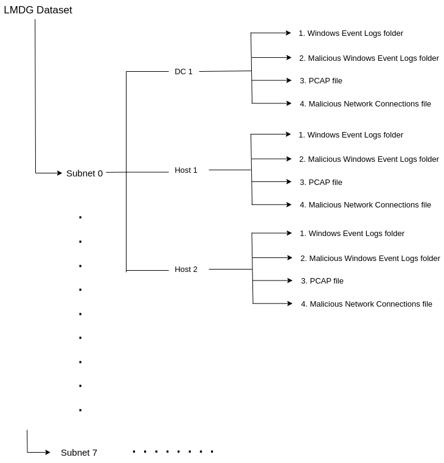

# LMDG: A Framework for Lateral Movement Datasets Generation

## Project Overview

This repository contains the documentation, code and dataset description for the paper titled *"[LMDG: A Framework for Lateral Movement Datasets Generation]"*. The **LMDG framework** is a cybersecurity research framework designed to simulate realistic organizational networks and generate high-fidelity datasets for studying advanced cyberattacks like lateral movement and advanced persistent threats (APTs). Built on **Virtualization** and **Active Directory (AD)**, it emulates diverse network topologies and realistic enterprise environments, integrating tools like **Wireshark** and **Windows Event Logs** for robust data collection. Key components include a flexible **Testbed creation process**, a **Benign Data Engine** for simulating realistic user behavior, an **Attack Engine (Caldera)** for automating adversary emulation, and an innovative **Labelling Engine** for accurately extracting attack records with minimal noise. This comprehensive framework enables the development and evaluation of advanced detection models in highly realistic settings. 

---

## Table of Contents
- [Project Overview](#project-overview)
- [Testbed Architecture](#testbed-architecture)
- [Dataset](#dataset)

---

## Testbed Architecture

This network, showed in figure 1, simulates a small-sized company with five departments, each residing in a distinct network segment with its dedicated Windows domain. For instance, the Sales department operates within the domain of sales.lmt.com and is situated in the subnet 192.168.59.0/24 with its dedicated domain controller DC 3. Three additional subnets are present in the network configuration: one signifies the root Windows domain lmt.com, another accommodates the company’s servers, and a third denotes a DMZ, i.e., 192.168.0.0/24 which is part of the IT Windows domain. Routers facilitate connections between these diverse subnets. Naturally, the structure of this network can be adjusted and expanded as needed.
  
In our experimental setup, VirtualBox networking was utilized to configure network segmentation. All subnets were established as internal networks, isolating them from external traffic, except the Demilitarized Zone (DMZ), which was configured as a NAT network. This NAT configuration allows the DMZ to communicate with external networks while maintaining the isolation of internal subnets, supporting a realistic simulation of enterprise network structures.

The experimental environment was configured with all Windows 10 and Windows 11 operating systems hosts, while servers operated on Windows Server 2022. This selection reflects commonly deployed systems in modern enterprise networks, ensuring the realism and relevance of the simulated environment for cybersecurity research.

This topology is realistic and superior to many commonly used topologies in the literature for several reasons. Firstly, it mirrors the complex, segmented network structure of a typical small to medium-sized enterprise, incorporating multiple subnets and dedicated Windows domains for different departments. This segmentation enhances security and reflects real-world organizational practices. Additionally, the inclusion of a Demilitarized Zone (DMZ) for public-facing services and separate subnets for critical infrastructure such as company servers and root domains provide a more accurate and comprehensive environment for generating datasets. These elements contribute to a higher fidelity simulation of enterprise network traffic and potential security threats, making the datasets derived from this topology more applicable and valuable for the research community.

---

## Dataset

### *Description*
The experimental environment comprises 25 virtual machines (VMs), including a Controller, a Caldera server, domain controllers, application servers, hosts, and routers. Over 22 valid user accounts were set up, but only 11 user credentials were leveraged by the Benign Data Engine to generate benign data on 11 hosts. Windows Event logs and PCAP files were collected from all Windows machines, excluding the Controller; no system logs or PCAPs were collected from the Caldera server. Additionally, PCAP files were captured from routers 1 and 2 to provide supplementary network data, though this traffic is also captured in the PCAP files from the hosts.

The dataset was generated over 25 days, from October 10, 2024, to November 3, 2024. The Benign Data Engine continuously simulated employee behavior throughout this time, producing benign data. Attack executions took place over 10 days, from October 23, 2024, to November 1, 2024, resulting in a dataset containing both benign and malicious activity during these days. The dataset exclusively contains benign data for the initial 14 days before October 23, 2024.

The total compressed dataset size, encompassing benign and malicious data (excluding router data), is 253 GB; when router data is included, the dataset size increases to 527 GB. Specifically, the compressed PCAP file from router 1 is 201 GB, and that from router 2 is 72 GB. The total uncompressed dataset amounts to 944 GB, with 900.93 GB comprising PCAP files and 43.38 GB for system log files. The total size of the attacks data in LMDG dataset is less than 1% with about 5000 records.

### *Dataset Structure*

The LMDG dataset will be organized into a main folder containing 8 subfolders, each representing a subnet numbered from 0 to 7, as illustrated in the testbed diagram. Additionally, there will be two more folders, each corresponding to a router. Within each subnet folder, there will be individual folders for each machine, named after the machine, containing data specific to that machine. For example, in subnet 0, there will be folders for "DC1," "Host 1," and "Host 2."

Each host folder will contain four subfolders:

1. **Windows Event Logs:** This folder will store all the raw Windows event logs from the machine, including both benign and malicious entries without any processing or labeling.

2. **Malicious Windows Event Logs:** This folder will contain a subset of the event logs that are specifically associated with malicious activities. These logs will follow a naming convention to ensure clarity:

Host-{Hostname}_Log-{Windows Event Log Name}_Sc-{Attack Scenario Number}_Ver-{Version Number}_Tri-{Trial Number}_Stp-{Attack Step Number}_StpSucc-{Binary Number}.csv

For example:
Host-{LMT-IT-DC01.it.lmt.com}_Log-{Security}_Sc-{1}_Ver-{1}_Tri-{1}_Stp-{2}_StpSucc-{1}.csv

The file mentioned above contains malicious records from the security log of the host LMT-IT-DC01.it.lmt.com, specifically related to the second step of the first attack scenario. The "StpSucc" field indicates whether the step was successful (StpSucc = 1) or failed (StpSucc = 0). The "Ver" (Version) and "Tri" (Trial) fields represent the execution of the same attack scenario on different subnets or hosts (Version), and multiple executions of the same scenario on the same subnet or host (Trial), as detailed in our paper.

Each CSV file includes three columns:

- RecordID: Refers to the specific record in the corresponding Windows event log.
- EventID: Represents the Windows event ID.
- TimeCreated: Shows the timestamp of when the event occurred.

3. **PCAP:** contains the packet capture file (PCAP) for the current machine. This file include all network traffic captured during the experiment, encompassing both benign and malicious traffic.

4. **Malicious Network Connections:** This folder holds the malicious network connections initiated by the current host (Windows Event ID 5156), with corresponding labels. It contains a CSV file named Malicious_Connections, which includes the following columns:

- TimeCreated: Timestamp of the connection.
- RecordID: Links to the specific record in the security log (Event ID 5156).
- ProcessID: Identifies the process that initiated the connection.
- SourceIP: The source IP address of the connection.
- SourcePort: The source port used in the connection.
- DestIP: The destination IP address of the connection.
- DestPort: The destination port.
- Direction: Direction of the connection (inbound/outbound).
- Protocol: The protocol used for the connection (e.g., TCP, UDP).
- Scenario: The attack scenario associated with the connection.
- Version: The version of the attack scenario.
- Trial: The trial number for the execution.
- Step: The step of the attack scenario.
- StepSucc: Indicates whether the step was successful (1) or failed (0).

The RecordID in this file points to the records in the security log with Event ID 5156, and additional connection data (e.g., process ID, IP addresses, ports) are included, with the same labeling system used to classify the attack scenario, version, trial, step, and step success.

By using the *Malicious Network Connections* file along with the PCAP file, malicious network flows can be identified and extracted. Additionally, there are two folders named "Router 1" and "Router 2," each containing a PCAP file that holds the network captures from their respective routers.

